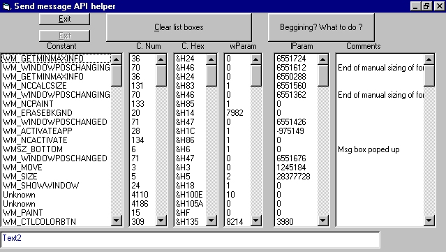



## SendMessage API Snoop

### Description

This is for API gurus. - SendMessage API

It observes ur form or controls on it for

messages comming from system. Puts them in

listboxes with all parameters. Selecting item

in listbox makes a reusable code with SendMessage
 
### More Info
 

             |
---                |---
**Submitted On**   |1998-11-13 22:50:28
**By**             |[M\.C](https://github.com/Planet-Source-Code/PSCIndex/blob/master/ByAuthor/m-c.md)
**Level**          |Advanced
**User Rating**    |5.0 (10 globes from 2 users)
**Compatibility**  |VB 6\.0
**Category**       |[Windows API Call/ Explanation](https://github.com/Planet-Source-Code/PSCIndex/blob/master/ByCategory/windows-api-call-explanation__1-39.md)
**World**          |[Visual Basic](https://github.com/Planet-Source-Code/PSCIndex/blob/master/ByWorld/visual-basic.md)
**Archive File**   |[CODE\_UPLOAD1279612182000\.zip](https://github.com/Planet-Source-Code/m-c-sendmessage-api-snoop__1-13677/archive/master.zip)

